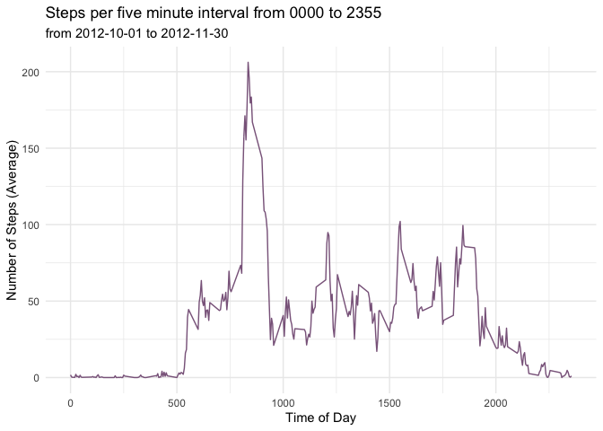

## Loading and preprocessing the data

```r
knitr::opts_chunk$set(echo=TRUE, eval=TRUE, warning=FALSE, error=FALSE, message=FALSE)
library(tidyverse)
options(scipen = 999)
```


```r
activity <- read_csv('./activity.zip')
```


## What is mean total number of steps taken per day?

 - Calculate the total number of steps taken per day: 

```r
byday <- activity %>%
  group_by(date) %>%
  summarise(steps = sum(steps, na.rm=FALSE), .groups="drop")
```

 - Make a histogram of the total number of steps taken each day


```r
ggplot(byday, aes(steps)) + 
  geom_histogram(binwidth=1000) +
  labs(title = "Steps per day",
      subtitle = paste("from", activity$date[1], "to", activity$date[nrow(activity)], sep=" "),
      x ="Daily Step Total",
      y = "Number of Days") +
  scale_y_continuous(limits = c(0,10), n.breaks=10, minor_breaks=NULL) +
  theme_minimal()
```

<!-- -->

 - Calculate and report the mean and median of the total number of steps taken per day
 

```r
mean_stepsperday <- mean(byday$steps, na.rm=TRUE)
median_stepsperday <- median(byday$steps, na.rm=TRUE)
```
    - Data have a mean of 10,766 steps per day
    - Data have a median of 10,765 steps per day


## What is the average daily activity pattern?

```r
dailypattern <- activity %>%
  group_by(interval) %>%
  summarise(avgsteps = mean(steps, na.rm=TRUE), .groups="drop")

maxinterval <- dailypattern$interval[dailypattern$avgsteps == max(dailypattern$avgsteps)]
```
 - Make a time series plot (i.e. type = "l") of the 5-minute interval (x-axis) and the average number of steps taken, averaged across all days (y-axis)

```r
ggplot(dailypattern, aes(x=interval, y=avgsteps)) +
  geom_line(color="plum4") +
  labs(title = "Steps per five minute interval from 0000 to 2355",
      subtitle = paste("from", activity$date[1], "to", activity$date[nrow(activity)], sep=" "),
      x ="Time of Day",
      y = "Number of Steps (Average)") +
  theme_minimal()
```

<!-- -->

 - Which 5-minute interval, on average across all the days in the dataset, contains the maximum number of steps?
  - It is the 5-minute interval starting at 835.


## Imputing missing values

 - Calculate and report the total number of missing values in the dataset (i.e. the total number of rows with  NAs)
 
 
 ```r
 stepsmissing <- sum(is.na(activity$steps))
 percentmissing <- stepsmissing/nrow(activity)
 ```
 
 - There are 2304 rows with NA for steps. This represents 13% of the data.
    
 - Devise a strategy for filling in all of the missing values in the dataset. The strategy does not need to be sophisticated. For example, you could use the mean/median for that day, or the mean for that 5-minute interval, etc.
 
    - using the mean for the 5 minute interval
 

```r
imputed <- activity %>% 
  left_join(dailypattern) %>%
  mutate(steps_imputed = if_else(is.na(steps), avgsteps, steps)) %>%
  select(-avgsteps)
```
 
 - Create a new dataset that is equal to the original dataset but with the missing data filled in.

 - Make a histogram of the total number of steps taken each day and Calculate and report the mean and median total number of steps taken per day. 
 
 

```r
byday <- imputed %>%
  group_by(date) %>%
  summarise(steps = sum(steps, na.rm=FALSE), .groups="drop")
ggplot(byday, aes(steps)) + 
  geom_histogram(binwidth=1000) +
  labs(title = "Steps per day w/missing replaced with interval mean",
      subtitle = paste("from", activity$date[1], "to", activity$date[nrow(activity)], sep=" "),
      x ="Daily Step Total",
      y = "Number of Days") +
  scale_y_continuous(limits = c(0,10), n.breaks=10, minor_breaks=NULL) +
  theme_minimal()
```

<!-- -->


```r
imean_stepsperday <- mean(byday$steps, na.rm=TRUE)
imedian_stepsperday <- median(byday$steps, na.rm=TRUE)

mean_dif = imean_stepsperday - mean_stepsperday
median_dif = imedian_stepsperday - median_stepsperday
```
    - Imputed Data have a mean of 10,766 steps per day
    - Imputed Data have a median of 10,765 steps per day.
 
 Do these values differ from the estimates from the first part of the assignment? 
    - The difference in mean is: 0 and the difference in median is 0
 
 What is the impact of imputing missing data on the estimates of the total daily number of steps?
    - There is no impact.

## Are there differences in activity patterns between weekdays and weekends?

Create a new factor variable in the dataset with two levels – “weekday” and “weekend” indicating whether a given date is a weekday or weekend day. Make a panel plot containing a time series plot (i.e. type = "l") of the 5-minute interval (x-axis) and the average number of steps taken, averaged across all weekday days or weekend days (y-axis). 


```r
df <- activity %>%
  mutate(weekpart = if_else(lubridate::wday(lubridate::ymd(date), week_start=1)>5, "weekend", "weekday")) %>%
  group_by(weekpart, interval) %>%
  summarise(avgsteps = mean(steps, na.rm=TRUE), .groups="drop")

ggplot(df, aes(x=interval, y=avgsteps, color=weekpart)) +
  geom_line() +
  labs(title = "Steps per five minute interval from 0000 to 2355",
      subtitle = paste("from", activity$date[1], "to", activity$date[nrow(activity)], sep=" "),
      x ="Time of Day",
      y = "Number of Steps (Average)") +
  theme_minimal() +
  facet_grid(vars(weekpart)) +
  theme(legend.position="none")
```

<!-- -->


